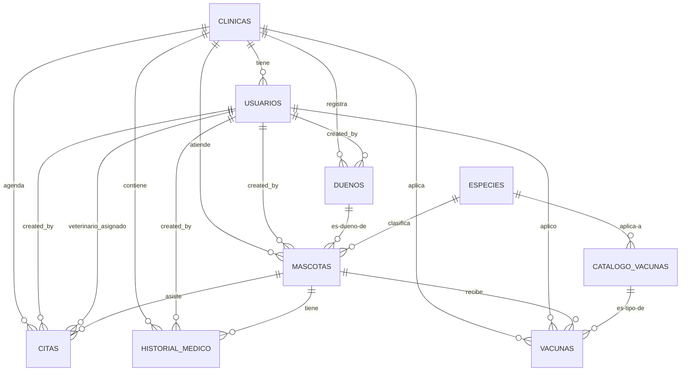

# Vetyx.io — Database Design (MVP v1.0)

| Versión | Fecha | Autor | Estado |
|---|---|---|---|
| 1.0 | 2026-06-12 | Database Architect | Aprobado |

**Documentos fuente:** `docs/01-prd.md`, `docs/02-frd.md`, `docs/03-architecture.md`

---

## Tabla de Contenidos

1. [Decisiones Arquitectónicas](#1-decisiones-arquitectónicas)
2. [Modelo Conceptual](#2-modelo-conceptual)
3. [Modelo Lógico](#3-modelo-lógico)
4. [Diccionario de Datos](#4-diccionario-de-datos)
5. [ERD Mermaid](#5-erd-mermaid)
6. [Índices](#6-índices)
7. [Tenant Isolation](#7-tenant-isolation)
8. [Soft Delete](#8-soft-delete)
9. [Audit Fields](#9-audit-fields)
10. [RLS Strategy](#10-rls-strategy)
11. [Storage (post-MVP)](#11-storage-post-mvp)
12. [Naming Convention](#12-naming-convention)

---

## 1. Decisiones Arquitectónicas

### D-DB-01: Species como tabla catálogo

| Contexto | Detalle |
|---|---|
| **Problema** | El FRD define especie como 3 valores fijos (Perro, Gato, Otro). PostgreSQL enum es la opción natural pero requiere `ALTER TYPE ... ADD VALUE` para extender, operación no transaccional y con limitaciones de gestión. |
| **Decisión** | Usar tabla `especies` con `id UUID`, `nombre VARCHAR(50) UNIQUE`. FKs desde `mascotas` y `catalogo_vacunas`. |
| **Seed MVP** | Perro, Gato, Otro. |
| **Extensibilidad** | Agregar una especie post-MVP = `INSERT INTO especies (nombre) VALUES ('Conejo')`. Sin migración de esquema. |
| **Trade-off** | Las queries de `mascotas` requieren JOIN a `especies` para mostrar el nombre. Las restricciones CHECK son menos directas (no podemos forzar CHECK contra valores de otra tabla). |
| **Consistencia** | Todas las listas cerradas del modelo (`rol`, `sexo`, `estado_cita`, `tipo_evento`) almacenadas como `VARCHAR` con CHECK, no como enums PostgreSQL. Misma razón: evitar `ALTER TYPE` en el futuro. |

### D-DB-02: Sin FK formal a auth.users

`usuarios.id` referencia `auth.users.id` lógicamente pero sin constraint FK formal. Supabase no recomienda FKs directas al schema `auth` por riesgos en migraciones internas de Supabase. La integridad se garantiza por lógica de aplicación (service_role en registro + validación en Server Actions).

### D-DB-03: Raza como columna TEXT, no tabla catálogo

`mascotas.raza` es `VARCHAR(80)` opcional. No existe tabla `razas` en MVP. Habilitar catálogo de razas post-MVP requeriría migración con nueva tabla + FK. Decisión consciente para mantener la simplicidad del MVP.

### D-DB-04: Doble reserva validada en aplicación

No existe exclusión constraint en PostgreSQL para evitar doble reserva de citas. Se valida en Server Action (SELECT count WHERE veterinario_id, fecha_hora, estado = 'confirmada' antes de INSERT). RLS no puede prevenir doble reserva porque ambas filas pertenecen a la misma clínica.

### D-DB-05: Sin tabla de auditoría separada en MVP

No hay `audit_log`. Se confía en:
- `created_by` y `created_at` en cada registro
- `updated_at` para detectar modificaciones
- Soft deletes (nunca se pierden registros)
- Ventana de edición de 24h en historial médico (regla FRD, validada en código)

---

## 2. Modelo Conceptual

### 10 entidades en 3 grupos

| Grupo | Entidad | Descripción | Abreviación |
|---|---|---|---|
| **Core** | Clínica | Tenant. Consultorio veterinario registrado en la plataforma. | CL |
| | Usuario | Miembro del staff con rol y permisos. | US |
| **Operación** | Dueño | Persona responsable de una o más mascotas. | DU |
| | Mascota | Paciente veterinario atendido por la clínica. | MA |
| | Cita | Evento de agenda con veterinario, fecha y hora. | CI |
| | Historial Médico | Registro clínico (consulta o cirugía) de una mascota. | HM |
| | Vacuna | Aplicación de vacuna a una mascota. | VA |
| **Catálogos** | Especie | Catálogo global de especies (extensible). | ES |
| | Catálogo Vacunas | Catálogo global de tipos de vacuna (semilla inicial). | CV |

Rol no es entidad separada; es atributo de Usuario con valores fijos: `admin`, `vet`, `recepcionista`.

### Reglas de Negocio (relaciones)

| # | Regla | Entidades involucradas |
|---|---|---|
| RN-01 | Una Clínica tiene N Usuarios. | CL → US |
| RN-02 | Un Usuario pertenece a exactamente una Clínica. | US → CL |
| RN-03 | Una Clínica tiene N Dueños. | CL → DU |
| RN-04 | Un Dueño pertenece a exactamente una Clínica. | DU → CL |
| RN-05 | Un Dueño tiene N Mascotas. | DU → MA |
| RN-06 | Una Mascota tiene exactamente un Dueño activo. | MA → DU |
| RN-07 | Una Mascota pertenece a exactamente una Clínica. | MA → CL |
| RN-08 | Una Mascota tiene una Especie (catálogo global). | MA → ES |
| RN-09 | Una Mascota tiene N Citas. | MA → CI |
| RN-10 | Una Cita tiene una Mascota y un Veterinario asignado. | CI → MA, CI → US(veterinario_id) |
| RN-11 | Una Mascota tiene N registros de Historial Médico. | MA → HM |
| RN-12 | Una Mascota tiene N Vacunas registradas. | MA → VA |
| RN-13 | Una Vacuna es de un tipo del Catálogo de Vacunas. | VA → CV |
| RN-14 | Un Catálogo de Vacuna aplica a una Especie (o cualquier especie si NULL). | CV → ES |
| RN-15 | Un Usuario puede crear N Dueños, Mascotas, Citas, Historial, Vacunas (trazabilidad). | US → DU/MA/CI/HM/VA(created_by) |
| RN-16 | Catálogos globales (especies, catalogo_vacunas) sin multi-tenant. Todas las clínicas comparten los mismos registros. | ES, CV son globales |

### Cardinalidades

| Entidad A | Relación | Entidad B | Cardinalidad |
|---|---|---|---|
| Clínica | tiene | Usuario | 1:N |
| Clínica | registra | Dueño | 1:N |
| Clínica | atiende | Mascota | 1:N |
| Clínica | agenda | Cita | 1:N |
| Clínica | contiene | Historial Médico | 1:N |
| Clínica | aplica | Vacuna | 1:N |
| Dueño | es dueño de | Mascota | 1:N |
| Mascota | asiste a | Cita | 1:N |
| Mascota | tiene | Historial Médico | 1:N |
| Mascota | recibe | Vacuna | 1:N |
| Especie | clasifica | Mascota | 1:N |
| Especie | aplica a | Catálogo Vacuna | 1:N (especie_id NULL = cualquier especie) |
| Catálogo Vacuna | es tipo de | Vacuna | 1:N |
| Usuario (vet) | asignado a | Cita | 1:N (veterinario_id) |
| Usuario | creado por | Dueño | 1:N (created_by) |
| Usuario | creado por | Mascota | 1:N (created_by) |
| Usuario | creado por | Cita | 1:N (created_by) |
| Usuario | creado por | Historial Médico | 1:N (created_by) |
| Usuario | aplicó | Vacuna | 1:N (aplicado_por) |

---

## 3. Modelo Lógico

### 3.1 clinicas

**Objetivo:** Gestionar el registro y configuración básica de cada tenant. Entidad raíz del multi-tenant.

| Campo | Tipo | Req | Default | FK | Descripción |
|---|---|---|---|---|---|
| `id` | `UUID` | Sí | `gen_random_uuid()` | — | Identificador único |
| `nombre` | `VARCHAR(120)` | Sí | — | — | Nombre comercial de la clínica |
| `slug` | `VARCHAR(80)` | Sí | — | — | Identificador URL amigable, único |
| `email` | `VARCHAR(255)` | Sí | — | — | Email de contacto |
| `telefono` | `VARCHAR(20)` | No | — | — | Teléfono de contacto |
| `direccion` | `TEXT` | No | — | — | Dirección física |
| `plan` | `VARCHAR(20)` | No | `'mvp'` | — | Plan de suscripción (MVP = solo 'mvp') |
| `activo` | `BOOLEAN` | No | `true` | — | Soft delete / baja del servicio |
| `fecha_registro` | `TIMESTAMPTZ` | No | `now()` | — | Fecha de creación del tenant |
| `created_at` | `TIMESTAMPTZ` | No | `now()` | — | Auditoría |
| `updated_at` | `TIMESTAMPTZ` | No | `now()` | — | Auditoría |

**Restricciones:**
- `slug UNIQUE`
- `CHECK (nombre <> '')`
- `CHECK (email ~* '^.+@.+\..+$')`

**Estados:** `Activa` → `Inactiva`

**Dependencias:** Ninguna (entidad raíz).

### 3.2 usuarios

**Objetivo:** Gestionar el equipo de trabajo de cada clínica con roles y permisos.

| Campo | Tipo | Req | Default | FK | Descripción |
|---|---|---|---|---|---|
| `id` | `UUID` | Sí | — | `auth.users.id`¹ | Identificador único (FK lógica) |
| `clinic_id` | `UUID` | Sí | — | `clinicas.id` | Tenant |
| `email` | `VARCHAR(255)` | Sí | — | — | Email de inicio de sesión |
| `nombre` | `VARCHAR(100)` | Sí | — | — | Nombre completo |
| `rol` | `VARCHAR(20)` | Sí | — | — | `admin`, `vet`, `recepcionista` |
| `telefono` | `VARCHAR(20)` | No | — | — | Teléfono de contacto |
| `activo` | `BOOLEAN` | No | `true` | — | Soft delete |
| `ultimo_acceso` | `TIMESTAMPTZ` | No | — | — | Último inicio de sesión |
| `created_at` | `TIMESTAMPTZ` | No | `now()` | — | Auditoría |
| `updated_at` | `TIMESTAMPTZ` | No | `now()` | — | Auditoría |

¹ FK lógica sin constraint formal por política de Supabase. Ver D-DB-02.

**Restricciones:**
- `UNIQUE(clinic_id, email)`
- `CHECK (rol IN ('admin', 'vet', 'recepcionista'))`

**Estados:** `Pendiente` (invitación enviada) → `Activo` → `Inactivo`

**Dependencias:** `clinicas` (clinic_id FK).

### 3.3 duenos

**Objetivo:** Registrar y gestionar los datos de contacto de los dueños de mascotas.

| Campo | Tipo | Req | Default | FK | Descripción |
|---|---|---|---|---|---|
| `id` | `UUID` | Sí | `gen_random_uuid()` | — | Identificador único |
| `clinic_id` | `UUID` | Sí | — | `clinicas.id` | Tenant |
| `nombre` | `VARCHAR(120)` | Sí | — | — | Nombre completo del dueño |
| `telefono` | `VARCHAR(20)` | Sí | — | — | Teléfono de contacto |
| `email` | `VARCHAR(255)` | No | — | — | Correo electrónico (recordatorios) |
| `direccion` | `TEXT` | No | — | — | Dirección física |
| `activo` | `BOOLEAN` | No | `true` | — | Soft delete |
| `created_by` | `UUID` | Sí | — | `usuarios.id` | Usuario que registró al dueño |
| `created_at` | `TIMESTAMPTZ` | No | `now()` | — | Auditoría |
| `updated_at` | `TIMESTAMPTZ` | No | `now()` | — | Auditoría |

**Restricciones:**
- `UNIQUE(clinic_id, telefono)`
- `CHECK (email IS NULL OR email ~* '^.+@.+\..+$')`

**Estados:** `Activo` → `Inactivo`

**Dependencias:** `clinicas` (clinic_id FK), `usuarios` (created_by FK).

### 3.4 especies — Catálogo Global

**Objetivo:** Catálogo de especies (extensible). Sin multi-tenant.

| Campo | Tipo | Req | Default | FK | Descripción |
|---|---|---|---|---|---|
| `id` | `UUID` | Sí | `gen_random_uuid()` | — | Identificador único |
| `nombre` | `VARCHAR(50)` | Sí | — | — | Nombre de la especie |
| `descripcion` | `TEXT` | No | — | — | Descripción opcional |
| `created_at` | `TIMESTAMPTZ` | No | `now()` | — | Auditoría |

**Restricciones:**
- `UNIQUE(nombre)`

**Seed inicial:**
| nombre | descripcion |
|---|---|
| Perro | Canis lupus familiaris |
| Gato | Felis catus |
| Otro | Otras especies (conejo, hurón, ave, etc.) |

**Dependencias:** Ninguna (catálogo global).

### 3.5 mascotas

**Objetivo:** Registrar y gestionar los datos clínicos básicos de cada paciente.

| Campo | Tipo | Req | Default | FK | Descripción |
|---|---|---|---|---|---|
| `id` | `UUID` | Sí | `gen_random_uuid()` | — | Identificador único |
| `clinic_id` | `UUID` | Sí | — | `clinicas.id` | Tenant |
| `owner_id` | `UUID` | Sí | — | `duenos.id` | Dueño responsable |
| `especie_id` | `UUID` | Sí | — | `especies.id` | Especie |
| `nombre` | `VARCHAR(80)` | Sí | — | — | Nombre de la mascota |
| `raza` | `VARCHAR(80)` | No | — | — | Raza (opcional, ver D-DB-03) |
| `fecha_nacimiento` | `DATE` | No | — | — | Fecha de nacimiento (aproximada válida) |
| `color` | `VARCHAR(80)` | No | — | — | Color o señas particulares |
| `peso` | `DECIMAL(5,1)` | No | — | — | Peso en kg |
| `sexo` | `VARCHAR(20)` | No | `'no_especificado'` | — | `macho`, `hembra`, `no_especificado` |
| `esterilizado` | `BOOLEAN` | No | `false` | — | Estado de esterilización |
| `activo` | `BOOLEAN` | No | `true` | — | Soft delete |
| `created_by` | `UUID` | Sí | — | `usuarios.id` | Usuario que registró |
| `created_at` | `TIMESTAMPTZ` | No | `now()` | — | Auditoría |
| `updated_at` | `TIMESTAMPTZ` | No | `now()` | — | Auditoría |

**Restricciones:**
- `CHECK (sexo IN ('macho', 'hembra', 'no_especificado'))`
- `CHECK (peso IS NULL OR (peso > 0 AND peso <= 200))`
- `CHECK (fecha_nacimiento IS NULL OR fecha_nacimiento <= current_date)`

**Estados:** `Activo` → `Inactivo`

**Dependencias:** `clinicas` (clinic_id FK), `duenos` (owner_id FK), `especies` (especie_id FK), `usuarios` (created_by FK).

### 3.6 citas

**Objetivo:** Gestionar la programación de citas médicas con slots de 30 minutos.

| Campo | Tipo | Req | Default | FK | Descripción |
|---|---|---|---|---|---|
| `id` | `UUID` | Sí | `gen_random_uuid()` | — | Identificador único |
| `clinic_id` | `UUID` | Sí | — | `clinicas.id` | Tenant |
| `mascota_id` | `UUID` | Sí | — | `mascotas.id` | Paciente |
| `veterinario_id` | `UUID` | Sí | — | `usuarios.id` | Veterinario asignado |
| `fecha_hora` | `TIMESTAMPTZ` | Sí | — | — | Día y hora de la cita |
| `duracion_minutos` | `INTEGER` | No | `30` | — | Duración del slot |
| `motivo` | `VARCHAR(200)` | Sí | — | — | Motivo de la consulta |
| `estado` | `VARCHAR(20)` | No | `'confirmada'` | — | `confirmada`, `completada`, `cancelada`, `no_show` |
| `monto` | `DECIMAL(10,2)` | No | — | — | Monto cobrado (al completar) |
| `notas_internas` | `TEXT` | No | — | — | Notas de la recepcionista |
| `motivo_cancelacion` | `TEXT` | No | — | — | Motivo si estado = 'cancelada' |
| `created_by` | `UUID` | Sí | — | `usuarios.id` | Usuario que agendó |
| `completed_by` | `UUID` | No | — | `usuarios.id` | Vet que completó la cita |
| `created_at` | `TIMESTAMPTZ` | No | `now()` | — | Auditoría |
| `updated_at` | `TIMESTAMPTZ` | No | `now()` | — | Auditoría |

**Restricciones:**
- `CHECK (estado IN ('confirmada', 'completada', 'cancelada', 'no_show'))`
- `CHECK (char_length(motivo) >= 5)`
- `CHECK (monto IS NULL OR monto >= 0)`
- `CHECK (motivo_cancelacion IS NULL OR estado = 'cancelada')`

**Estados y transiciones:**
```
Confirmada ──→ Completada
Confirmada ──→ Cancelada
Confirmada ──→ No-show
No-show ──→ Cancelada
Completada → (terminal)
Cancelada → (terminal)
```

**Dependencias:** `clinicas` (clinic_id FK), `mascotas` (mascota_id FK), `usuarios` (veterinario_id FK, created_by FK, completed_by FK).

### 3.7 historial_medico

**Objetivo:** Mantener un registro cronológico e inmutable de todos los eventos médicos de cada paciente.

| Campo | Tipo | Req | Default | FK | Descripción |
|---|---|---|---|---|---|
| `id` | `UUID` | Sí | `gen_random_uuid()` | — | Identificador único |
| `clinic_id` | `UUID` | Sí | — | `clinicas.id` | Tenant |
| `mascota_id` | `UUID` | Sí | — | `mascotas.id` | Paciente |
| `tipo` | `VARCHAR(20)` | Sí | — | — | `consulta`, `cirugia` |
| `fecha` | `DATE` | Sí | — | — | Fecha del evento |
| `diagnostico` | `TEXT` | Sí | — | — | Diagnóstico (inmutable post 24h) |
| `tratamiento` | `TEXT` | No | — | — | Tratamiento (editable 24h) |
| `notas` | `TEXT` | No | — | — | Notas internas del vet (editable 24h) |
| `created_by` | `UUID` | Sí | — | `usuarios.id` | Veterinario que registró |
| `created_at` | `TIMESTAMPTZ` | No | `now()` | — | Auditoría |
| `updated_at` | `TIMESTAMPTZ` | No | `now()` | — | Auditoría |

**Restricciones:**
- `CHECK (tipo IN ('consulta', 'cirugia'))`
- `CHECK (char_length(diagnostico) >= 10)`
- `CHECK (fecha <= current_date)`

**Estados:** Los eventos del historial son inmutables (no tienen máquina de estados). Distinción visual por tipo:
- `consulta` → ícono azul
- `cirugia` → ícono rojo
- (vacunas desde módulo Vacunas → ícono verde)

**Dependencias:** `clinicas` (clinic_id FK), `mascotas` (mascota_id FK), `usuarios` (created_by FK).

### 3.8 catalogo_vacunas — Catálogo Global

**Objetivo:** Catálogo global de tipos de vacuna. Precargado, no editable por la clínica en MVP.

| Campo | Tipo | Req | Default | FK | Descripción |
|---|---|---|---|---|---|
| `id` | `UUID` | Sí | `gen_random_uuid()` | — | Identificador único |
| `nombre` | `VARCHAR(100)` | Sí | — | — | Nombre de la vacuna |
| `especie_id` | `UUID` | No | — | `especies.id` | Especie destino (NULL = cualquier especie) |
| `dosis_tipica` | `VARCHAR(100)` | No | — | — | Esquema de dosis |
| `created_at` | `TIMESTAMPTZ` | No | `now()` | — | Auditoría |

**Restricciones:**
- `UNIQUE(nombre)`

**Seed inicial:**

| nombre | especie_id | dosis_tipica |
|---|---|---|
| Múltiple canina (quíntuple séxtuple) | Perro | 3 dosis + refuerzo anual |
| Antirrábica canina | Perro | 1 dosis + refuerzo anual |
| Tos de las perreras (Bordetella) | Perro | 1 dosis + refuerzo anual |
| Leptospirosis canina | Perro | 2 dosis + refuerzo anual |
| Triple felina | Gato | 2 dosis + refuerzo anual |
| Antirrábica felina | Gato | 1 dosis + refuerzo anual |
| Leucemia felina (FeLV) | Gato | 2 dosis + refuerzo anual |
| Otra | NULL (cualquier especie) | A criterio del vet |

**Dependencias:** `especies` (especie_id FK, nullable).

### 3.9 vacunas

**Objetivo:** Registrar la aplicación de vacunas y calcular próximas dosis.

| Campo | Tipo | Req | Default | FK | Descripción |
|---|---|---|---|---|---|
| `id` | `UUID` | Sí | `gen_random_uuid()` | — | Identificador único |
| `clinic_id` | `UUID` | Sí | — | `clinicas.id` | Tenant |
| `mascota_id` | `UUID` | Sí | — | `mascotas.id` | Paciente |
| `tipo_vacuna_id` | `UUID` | Sí | — | `catalogo_vacunas.id` | Tipo de vacuna aplicada |
| `lote` | `VARCHAR(50)` | No | — | — | Número de lote |
| `fecha_aplicacion` | `DATE` | Sí | — | — | Fecha de aplicación |
| `fecha_proxima_dosis` | `DATE` | No | — | — | Próximo refuerzo |
| `recordatorio_enviado` | `INTEGER` | No | `0` | — | Contador 0-3 |
| `aplicado_por` | `UUID` | Sí | — | `usuarios.id` | Vet que aplicó |
| `created_at` | `TIMESTAMPTZ` | No | `now()` | — | Auditoría |
| `updated_at` | `TIMESTAMPTZ` | No | `now()` | — | Auditoría |

**Restricciones:**
- `CHECK (fecha_aplicacion <= current_date)`
- `CHECK (fecha_proxima_dosis IS NULL OR fecha_proxima_dosis > fecha_aplicacion)`
- `CHECK (recordatorio_enviado BETWEEN 0 AND 3)`

**Estados:** `Aplicada` → si `fecha_proxima_dosis` existe → `Pendiente refuerzo`. El estado "vencida" se determina por consulta (fecha_proxima_dosis < current_date sin nueva vacuna cubriendo esa dosis).

**Dependencias:** `clinicas` (clinic_id FK), `mascotas` (mascota_id FK), `catalogo_vacunas` (tipo_vacuna_id FK), `usuarios` (aplicado_por FK).

---

## 4. Diccionario de Datos

### 4.1 clinicas

| # | Campo | Tipo | Longitud | Requerido | Default | FK | Descripción |
|---|---|---|---|---|---|---|---|
| 1 | id | UUID | — | Sí | `gen_random_uuid()` | — | Identificador único |
| 2 | nombre | VARCHAR | 120 | Sí | — | — | Nombre comercial |
| 3 | slug | VARCHAR | 80 | Sí | — | — | URL amigable único |
| 4 | email | VARCHAR | 255 | Sí | — | — | Email de contacto |
| 5 | telefono | VARCHAR | 20 | No | — | — | Teléfono |
| 6 | direccion | TEXT | — | No | — | — | Dirección física |
| 7 | plan | VARCHAR | 20 | No | `'mvp'` | — | Plan suscripción |
| 8 | activo | BOOLEAN | — | No | `true` | — | Soft delete |
| 9 | fecha_registro | TIMESTAMPTZ | — | No | `now()` | — | Fecha creación |
| 10 | created_at | TIMESTAMPTZ | — | No | `now()` | — | Auditoría |
| 11 | updated_at | TIMESTAMPTZ | — | No | `now()` | — | Auditoría |

### 4.2 usuarios

| # | Campo | Tipo | Longitud | Requerido | Default | FK | Descripción |
|---|---|---|---|---|---|---|---|
| 1 | id | UUID | — | Sí | — | `auth.users.id`¹ | Identificador único |
| 2 | clinic_id | UUID | — | Sí | — | `clinicas.id` | Tenant |
| 3 | email | VARCHAR | 255 | Sí | — | — | Email de login |
| 4 | nombre | VARCHAR | 100 | Sí | — | — | Nombre completo |
| 5 | rol | VARCHAR | 20 | Sí | — | — | admin, vet, recepcionista |
| 6 | telefono | VARCHAR | 20 | No | — | — | Teléfono |
| 7 | activo | BOOLEAN | — | No | `true` | — | Soft delete |
| 8 | ultimo_acceso | TIMESTAMPTZ | — | No | — | — | Último login |
| 9 | created_at | TIMESTAMPTZ | — | No | `now()` | — | Auditoría |
| 10 | updated_at | TIMESTAMPTZ | — | No | `now()` | — | Auditoría |

¹ FK lógica sin constraint formal.

### 4.3 duenos

| # | Campo | Tipo | Longitud | Requerido | Default | FK | Descripción |
|---|---|---|---|---|---|---|---|
| 1 | id | UUID | — | Sí | `gen_random_uuid()` | — | Identificador único |
| 2 | clinic_id | UUID | — | Sí | — | `clinicas.id` | Tenant |
| 3 | nombre | VARCHAR | 120 | Sí | — | — | Nombre completo |
| 4 | telefono | VARCHAR | 20 | Sí | — | — | Teléfono |
| 5 | email | VARCHAR | 255 | No | — | — | Correo |
| 6 | direccion | TEXT | — | No | — | — | Dirección |
| 7 | activo | BOOLEAN | — | No | `true` | — | Soft delete |
| 8 | created_by | UUID | — | Sí | — | `usuarios.id` | Quién registró |
| 9 | created_at | TIMESTAMPTZ | — | No | `now()` | — | Auditoría |
| 10 | updated_at | TIMESTAMPTZ | — | No | `now()` | — | Auditoría |

### 4.4 especies

| # | Campo | Tipo | Longitud | Requerido | Default | FK | Descripción |
|---|---|---|---|---|---|---|---|
| 1 | id | UUID | — | Sí | `gen_random_uuid()` | — | Identificador único |
| 2 | nombre | VARCHAR | 50 | Sí | — | — | Perro, Gato, Otro |
| 3 | descripcion | TEXT | — | No | — | — | Descripción opcional |
| 4 | created_at | TIMESTAMPTZ | — | No | `now()` | — | Auditoría |

### 4.5 mascotas

| # | Campo | Tipo | Longitud | Requerido | Default | FK | Descripción |
|---|---|---|---|---|---|---|---|
| 1 | id | UUID | — | Sí | `gen_random_uuid()` | — | Identificador único |
| 2 | clinic_id | UUID | — | Sí | — | `clinicas.id` | Tenant |
| 3 | owner_id | UUID | — | Sí | — | `duenos.id` | Dueño |
| 4 | especie_id | UUID | — | Sí | — | `especies.id` | Especie |
| 5 | nombre | VARCHAR | 80 | Sí | — | — | Nombre |
| 6 | raza | VARCHAR | 80 | No | — | — | Raza |
| 7 | fecha_nacimiento | DATE | — | No | — | — | Fecha nacimiento |
| 8 | color | VARCHAR | 80 | No | — | — | Color/señas |
| 9 | peso | DECIMAL(5,1) | 5,1 | No | — | — | Peso kg |
| 10 | sexo | VARCHAR | 20 | No | `'no_especificado'` | — | macho, hembra, no_especificado |
| 11 | esterilizado | BOOLEAN | — | No | `false` | — | Esterilización |
| 12 | activo | BOOLEAN | — | No | `true` | — | Soft delete |
| 13 | created_by | UUID | — | Sí | — | `usuarios.id` | Quién registró |
| 14 | created_at | TIMESTAMPTZ | — | No | `now()` | — | Auditoría |
| 15 | updated_at | TIMESTAMPTZ | — | No | `now()` | — | Auditoría |

### 4.6 citas

| # | Campo | Tipo | Longitud | Requerido | Default | FK | Descripción |
|---|---|---|---|---|---|---|---|
| 1 | id | UUID | — | Sí | `gen_random_uuid()` | — | Identificador único |
| 2 | clinic_id | UUID | — | Sí | — | `clinicas.id` | Tenant |
| 3 | mascota_id | UUID | — | Sí | — | `mascotas.id` | Paciente |
| 4 | veterinario_id | UUID | — | Sí | — | `usuarios.id` | Vet asignado |
| 5 | fecha_hora | TIMESTAMPTZ | — | Sí | — | — | Día y hora |
| 6 | duracion_minutos | INTEGER | — | No | `30` | — | Duración slot |
| 7 | motivo | VARCHAR | 200 | Sí | — | — | Motivo consulta |
| 8 | estado | VARCHAR | 20 | No | `'confirmada'` | — | confirmada, completada, cancelada, no_show |
| 9 | monto | DECIMAL(10,2) | 10,2 | No | — | — | Monto cobrado |
| 10 | notas_internas | TEXT | — | No | — | — | Notas recepcionista |
| 11 | motivo_cancelacion | TEXT | — | No | — | — | Motivo cancelación |
| 12 | created_by | UUID | — | Sí | — | `usuarios.id` | Quién agendó |
| 13 | completed_by | UUID | — | No | — | `usuarios.id` | Vet que completó |
| 14 | created_at | TIMESTAMPTZ | — | No | `now()` | — | Auditoría |
| 15 | updated_at | TIMESTAMPTZ | — | No | `now()` | — | Auditoría |

### 4.7 historial_medico

| # | Campo | Tipo | Longitud | Requerido | Default | FK | Descripción |
|---|---|---|---|---|---|---|---|
| 1 | id | UUID | — | Sí | `gen_random_uuid()` | — | Identificador único |
| 2 | clinic_id | UUID | — | Sí | — | `clinicas.id` | Tenant |
| 3 | mascota_id | UUID | — | Sí | — | `mascotas.id` | Paciente |
| 4 | tipo | VARCHAR | 20 | Sí | — | — | consulta, cirugia |
| 5 | fecha | DATE | — | Sí | — | — | Fecha del evento |
| 6 | diagnostico | TEXT | — | Sí | — | — | Diagnóstico |
| 7 | tratamiento | TEXT | — | No | — | — | Tratamiento |
| 8 | notas | TEXT | — | No | — | — | Notas internas |
| 9 | created_by | UUID | — | Sí | — | `usuarios.id` | Vet que registró |
| 10 | created_at | TIMESTAMPTZ | — | No | `now()` | — | Auditoría |
| 11 | updated_at | TIMESTAMPTZ | — | No | `now()` | — | Auditoría |

### 4.8 catalogo_vacunas

| # | Campo | Tipo | Longitud | Requerido | Default | FK | Descripción |
|---|---|---|---|---|---|---|---|
| 1 | id | UUID | — | Sí | `gen_random_uuid()` | — | Identificador único |
| 2 | nombre | VARCHAR | 100 | Sí | — | — | Nombre vacuna |
| 3 | especie_id | UUID | — | No | — | `especies.id` | Especie (NULL = cualquier) |
| 4 | dosis_tipica | VARCHAR | 100 | No | — | — | Esquema dosis |
| 5 | created_at | TIMESTAMPTZ | — | No | `now()` | — | Auditoría |

### 4.9 vacunas

| # | Campo | Tipo | Longitud | Requerido | Default | FK | Descripción |
|---|---|---|---|---|---|---|---|
| 1 | id | UUID | — | Sí | `gen_random_uuid()` | — | Identificador único |
| 2 | clinic_id | UUID | — | Sí | — | `clinicas.id` | Tenant |
| 3 | mascota_id | UUID | — | Sí | — | `mascotas.id` | Paciente |
| 4 | tipo_vacuna_id | UUID | — | Sí | — | `catalogo_vacunas.id` | Tipo de vacuna |
| 5 | lote | VARCHAR | 50 | No | — | — | Número de lote |
| 6 | fecha_aplicacion | DATE | — | Sí | — | — | Fecha aplicación |
| 7 | fecha_proxima_dosis | DATE | — | No | — | — | Próximo refuerzo |
| 8 | recordatorio_enviado | INTEGER | — | No | `0` | — | Contador 0-3 |
| 9 | aplicado_por | UUID | — | Sí | — | `usuarios.id` | Vet que aplicó |
| 10 | created_at | TIMESTAMPTZ | — | No | `now()` | — | Auditoría |
| 11 | updated_at | TIMESTAMPTZ | — | No | `now()` | — | Auditoría |

---

## 5. ERD Mermaid



---

## 6. Índices

### 6.1 Definidos por restricción de unicidad

| Tabla | Índice | Tipo | Propósito |
|---|---|---|---|
| `clinicas` | `UNIQUE (slug)` | B-tree único | Slug único global |
| `usuarios` | `UNIQUE (clinic_id, email)` | B-tree único | Login único por clínica |
| `duenos` | `UNIQUE (clinic_id, telefono)` | B-tree único | Teléfono único por clínica |
| `especies` | `UNIQUE (nombre)` | B-tree único | Nombre único global |
| `catalogo_vacunas` | `UNIQUE (nombre)` | B-tree único | Nombre único global |

### 6.2 Índices de performance

| Tabla | Índice | Tipo | Propósito |
|---|---|---|---|
| `duenos` | `(clinic_id, nombre)` | B-tree | Búsqueda por nombre |
| `duenos` | `(clinic_id) WHERE activo = true` | B-tree parcial | Filtrar activos en búsqueda |
| `mascotas` | `(clinic_id, nombre)` | B-tree | Búsqueda por nombre |
| `mascotas` | `(clinic_id, owner_id)` | B-tree | Listar mascotas de un dueño |
| `mascotas` | `(clinic_id) WHERE activo = true` | B-tree parcial | Filtrar activos |
| `citas` | `(clinic_id, veterinario_id, fecha_hora) WHERE estado = 'confirmada'` | B-tree parcial | Validar doble reserva |
| `citas` | `(clinic_id, fecha_hora)` | B-tree | Vista agenda diaria/semanal |
| `citas` | `(clinic_id, estado)` | B-tree | Dashboard (agregación) |
| `citas` | `(clinic_id, veterinario_id, fecha_hora)` | B-tree | Vista del vet en agenda |
| `historial_medico` | `(clinic_id, mascota_id, fecha DESC)` | B-tree | Línea de tiempo descendente |
| `vacunas` | `(clinic_id, mascota_id)` | B-tree | Historial de vacunas del paciente |
| `vacunas` | `(fecha_proxima_dosis) WHERE recordatorio_enviado < 3` | B-tree parcial | Worker de recordatorios |

---

## 7. Tenant Isolation

| Aspecto | Decisión |
|---|---|
| **Columna** | `clinic_id UUID NOT NULL REFERENCES clinicas(id)` en toda tabla de operación |
| **Tablas con clinic_id** | `usuarios`, `duenos`, `mascotas`, `citas`, `historial_medico`, `vacunas` |
| **Tablas sin clinic_id** | `especies`, `catalogo_vacunas` (catálogos globales) |
| **Asignación** | Siempre desde servidor via `getCurrentUser().clinic_id`. Nunca del input del cliente. |
| **Propagación** | `auth.users.id` → `usuarios.clinic_id` → inyectado en cada Server Action |
| **Validación** | Doble capa: código (Server Action) + RLS (base de datos) |
| **Catálogos globales** | Acceso `SELECT` a cualquier usuario autenticado de cualquier clínica |
| **Excepción** | Registro inicial de clínica + admin usa `service_role` (bypass RLS). No hay `clinic_id` disponible aún. |

### Flujo de aislamiento

```
Usuario autenticado
       │
       ▼
Server Action
  ├── getSession() → userId
  ├── getCurrentUser(userId) → { clinic_id, rol, nombre }
  └── INSERT INTO mascotas (clinic_id, ...)
                            │
                            ▼
              RLS verifica: clinic_id = get_user_clinic_id()
                            │
                            ▼
              PostgreSQL: datos aislados por tenant
```

---

## 8. Soft Delete

| Tabla | Campo | Aplica | Excepciones |
|---|---|---|---|
| `clinicas` | `activo BOOLEAN DEFAULT true` | Sí | — |
| `usuarios` | `activo BOOLEAN DEFAULT true` | Sí | — |
| `duenos` | `activo BOOLEAN DEFAULT true` | Sí | No desactivar si tiene mascotas activas (validación en código) |
| `mascotas` | `activo BOOLEAN DEFAULT true` | Sí | No agendar citas si inactiva (validación en código) |
| `citas` | — | No | Estados terminales: `completada`, `cancelada`. Sin soft delete. |
| `historial_medico` | — | No | Eventos inmutables (pista de auditoría médica). No se eliminan ni se ocultan. |
| `vacunas` | — | No | Registros de aplicación inmutables. No se eliminan. |

**Para tablas con soft delete:** 100% de las queries incluyen `WHERE activo = true`. Los registros inactivos solo son visibles para admin en vistas de administración (reportes, reactivación).

**Integridad referencial:** No hay restricción FK que impida referenciar un registro inactivo. La validación se hace en código (ej: no se puede crear cita para una mascota inactiva).

---

## 9. Audit Fields

### 9.1 Campos estándar por tabla

| Campo | Tipo | Default | Tablas | Propósito |
|---|---|---|---|---|
| `created_at` | `TIMESTAMPTZ` | `now()` | Todas | Trazabilidad de creación |
| `updated_at` | `TIMESTAMPTZ` | `now()` | Todas | Trazabilidad de última modificación |

### 9.2 Campos de trazabilidad por tabla

| Tabla | Campo | FK | Propósito |
|---|---|---|---|
| `duenos` | `created_by` | `usuarios.id` | Quién registró al dueño |
| `mascotas` | `created_by` | `usuarios.id` | Quién registró la mascota |
| `citas` | `created_by` | `usuarios.id` | Quién agendó la cita |
| `citas` | `completed_by` | `usuarios.id` | Vet que completó la cita |
| `historial_medico` | `created_by` | `usuarios.id` | Vet que hizo el registro |
| `vacunas` | `aplicado_por` | `usuarios.id` | Vet que aplicó la vacuna |
| `usuarios` | `ultimo_acceso` | — | Último inicio de sesión (timestamp) |

### 9.3 Trigger de updated_at

Toda tabla con `updated_at` tendrá un trigger `before update` que asigna `now()` automáticamente. Función reutilizable:

```sql
CREATE OR REPLACE FUNCTION set_updated_at()
RETURNS TRIGGER AS $$
BEGIN
  NEW.updated_at = now();
  RETURN NEW;
END;
$$ LANGUAGE plpgsql;
```

Un trigger por tabla: `CREATE TRIGGER trg_set_updated_at BEFORE UPDATE ON clinicas FOR EACH ROW EXECUTE FUNCTION set_updated_at();`

### 9.4 Sin tabla de auditoría separada

En MVP no existe tabla `audit_log`. Se confía en:
- `created_by` para conocer quién creó cada registro
- `updated_at` para detectar modificaciones
- Soft deletes para preservar datos eliminados lógicamente
- Ventana de edición de 24h en historial médico (regla FRD, validada en código, no en DB)

---

## 10. RLS Strategy

### 10.1 Principio

Cada política asume que el usuario está autenticado y solo permite acceder a datos de su propia clínica. RLS es la última línea de defensa; la autorización por rol se hace en código (Server Actions).

### 10.2 Función helper

```sql
CREATE OR REPLACE FUNCTION public.get_user_clinic_id()
RETURNS UUID
LANGUAGE SQL STABLE
AS $$
  SELECT clinic_id FROM public.usuarios WHERE id = auth.uid()
$$;
```

### 10.3 Políticas por tabla

#### clinicas

| Operación | Política | Regla |
|---|---|---|
| SELECT | `clinicas_select_own` | `id = public.get_user_clinic_id()` |
| INSERT | — | Solo via service_role (registro) |
| UPDATE | `clinicas_update_admin` | `id = public.get_user_clinic_id()` + rol = admin |
| DELETE | — | No permitido (soft delete vía UPDATE activo = false) |

#### usuarios

| Operación | Política | Regla |
|---|---|---|
| SELECT | `usuarios_select_same_clinic` | `clinic_id = public.get_user_clinic_id()` |
| INSERT | `usuarios_insert_admin` | Rol = admin + `clinic_id = public.get_user_clinic_id()` |
| UPDATE | `usuarios_update_admin` | Rol = admin + `clinic_id = public.get_user_clinic_id()` |
| DELETE | — | No permitido (soft delete vía UPDATE) |

#### duenos, mascotas, citas, historial_medico, vacunas

| Operación | Política | Regla |
|---|---|---|
| ALL | `tenant_isolation` | `clinic_id = public.get_user_clinic_id()` |

`FOR ALL` cubre SELECT, INSERT, UPDATE, DELETE.
- `USING` controla visibilidad de filas existentes.
- `WITH CHECK` controla filas nuevas o modificadas.

Para DELETE: las tablas que soportan soft delete (duenos, mascotas) se marcan como `FOR DELETE: false` explícitamente para reforzar la restricción a nivel DB.

#### especies, catalogo_vacunas (catálogos globales)

| Operación | Política | Regla |
|---|---|---|
| SELECT | `catalogos_select_authenticated` | `auth.role() = 'authenticated'` |
| INSERT | — | Solo seed vía migración |
| UPDATE | — | Solo seed vía migración |
| DELETE | — | Solo seed vía migración |

### 10.4 Resumen de RLS

| Tabla | RLS Activado | Políticas | Bypass |
|---|---|---|---|
| `clinicas` | Sí | SELECT, UPDATE (admin) | Service_role (registro) |
| `usuarios` | Sí | SELECT, INSERT (admin), UPDATE (admin) | Service_role (invitación) |
| `duenos` | Sí | ALL (tenant_isolation) | — |
| `mascotas` | Sí | ALL (tenant_isolation) | — |
| `citas` | Sí | ALL (tenant_isolation) | — |
| `historial_medico` | Sí | ALL (tenant_isolation) | — |
| `vacunas` | Sí | ALL (tenant_isolation) | — |
| `especies` | Sí | SELECT (autenticado) | — |
| `catalogo_vacunas` | Sí | SELECT (autenticado) | — |
| `auth.users` | — | Gestión interna de Supabase | — |

### 10.5 Clientes de Supabase

| Cliente | Key | RLS | Uso |
|---|---|---|---|
| `createServerActionClient` | anon + JWT | ✅ | 95% de operaciones CRUD |
| `createServerComponentClient` | anon + JWT | ✅ | Lectura inicial en layouts |
| `createServiceRoleClient` | service_role | ❌ | Solo registro e invitación |

### 10.6 Doble capa de seguridad

| Capa | Previene |
|---|---|
| **Server Action (código)** | Errores de programación, clinic_id incorrecto, permisos de rol |
| **RLS (base de datos)** | Bypass accidental, bugs en código, acceso directo a DB |

---

## 11. Storage (post-MVP)

No implementado en MVP v1.0. Estrategia documentada para implementación futura.

### 11.1 Bucket

```
Nombre: fotos-mascotas
Visibilidad: privado
```

### 11.2 Path pattern

```
{clinic_id}/{mascota_id}/{uuid}.{ext}
```

Ejemplo: `a1b2c3d4-e5f6-7890-abcd-ef1234567890/9876f543-21ed-4321-abcd-1234567890ab/photo-2026-06-12.jpg`

### 11.3 RLS para Storage

```sql
CREATE POLICY "storage_tenant_isolation" ON storage.objects
  FOR ALL
  USING (
    bucket_id = 'fotos-mascotas'
    AND (storage.foldername(name))[1] = public.get_user_clinic_id()::text
  );
```

### 11.4 Notas

- Sin Storage en MVP: toda la información se almacena como texto en PostgreSQL.
- Post-MVP: las fotos de mascotas se almacenarán en Supabase Storage con el path basado en `clinic_id` para mantener el aislamiento de tenant.
- Sin soporte para imágenes en el MVP (ni foto de mascota, ni foto de perfil de usuario).

---

## 12. Naming Convention

### 12.1 Convenciones generales

| Ámbito | Convención | Ejemplo |
|---|---|---|
| **Idioma** | Español | — |
| **Tablas** | Plural, snake_case | `historial_medico`, `catalogo_vacunas` |
| **Columnas** | snake_case | `fecha_proxima_dosis`, `motivo_cancelacion` |
| **Primary Keys** | `id UUID DEFAULT gen_random_uuid()` | `id` |
| **Foreign Keys** | `tabla_origen_id` | `mascota_id`, `especie_id`, `clinic_id` |
| **Timestamps** | `created_at`, `updated_at` | `TIMESTAMPTZ DEFAULT now()` |
| **Soft delete** | `activo BOOLEAN DEFAULT true` | `activo` |
| **Booleanos** | Prefijo `es_` o `tiene_` cuando aplique | `esterilizado` (sin prefijo por ser adjetivo directo) |
| **Decimales** | `DECIMAL(precisión, escala)` | `DECIMAL(5,1)` para peso, `DECIMAL(10,2)` para monto |

### 12.2 Listas cerradas (VARCHAR + CHECK)

| Tabla | Columna | Valores permitidos |
|---|---|---|
| `usuarios` | `rol` | `'admin'`, `'vet'`, `'recepcionista'` |
| `mascotas` | `sexo` | `'macho'`, `'hembra'`, `'no_especificado'` |
| `citas` | `estado` | `'confirmada'`, `'completada'`, `'cancelada'`, `'no_show'` |
| `historial_medico` | `tipo` | `'consulta'`, `'cirugia'` |
| `clinicas` | `plan` | `'mvp'` |

**Nota:** No se usan enums de PostgreSQL en ninguna tabla por la misma razón que `especies` es tabla catálogo: evitar migraciones `ALTER TYPE`. Los CHECK constraints se pueden modificar con `ALTER TABLE ... DROP CONSTRAINT ... ADD CONSTRAINT ...` sin las limitaciones de los enums nativos.

### 12.3 Nombres de constraints e índices

| Tipo | Patrón | Ejemplo |
|---|---|---|
| Primary Key | `pk_nombre_tabla` | `pk_usuarios` |
| Foreign Key | `fk_tabla_origen_tabla_destino` | `fk_mascotas_duenos` |
| Unique | `uq_tabla_columnas` | `uq_usuarios_clinic_id_email` |
| Check | `ck_tabla_descripcion` | `ck_citas_estado_valido` |
| Index | `idx_tabla_columnas` | `idx_citas_fecha_hora` |
| Trigger | `trg_tabla_accion` | `trg_clinicas_set_updated_at` |
| Policy RLS | `nombre_tabla_accion` | `tenant_isolation` o `usuarios_select_same_clinic` |

---

*Documento complementario al PRD v1.0, FRD v1.0 y Architecture v1.0. Para contexto completo, referirse a `docs/01-prd.md` (qué construir), `docs/02-frd.md` (cómo funciona) y `docs/03-architecture.md` (cómo se implementa).*
